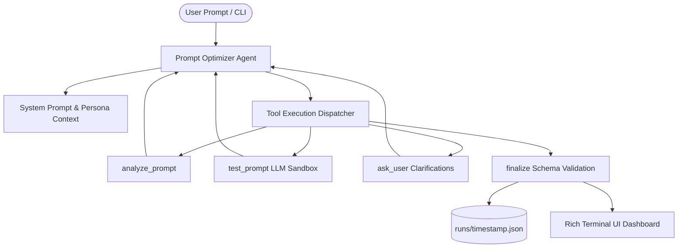

# Prompt Optimizer Agent - Architectural & Implementation Plan

## 1. Executive Summary & Overview
The **Prompt Optimizer Agent** is an autonomous, tool-augmented LLM agent designed to transform rough, ambiguous, or underspecified prompts into structured, highly effective prompts for AI models (e.g., Claude, GPT-4, Llama).

### Key Objectives:
- **Preserve User Intent**: Refine tone, structure, and clarity without altering core requirements.
- **Standardized Output Format**: Transform raw input into structured prompts with explicit **Role**, **Context**, **Task**, **Constraints**, **Output Format**, and **Examples**.
- **Iterative Refinement**: Execute a closed-loop agent trajectory using specialized tools (`analyze_prompt`, `test_prompt`, `ask_user`, `finalize`).
- **Strict Guardrails**: Enforce step limits, timeouts, schema validation, and early exit conditions to guarantee fast, deterministic execution.

---

## 2. System Architecture & Flow



---

## 3. Core Component Breakdown

### 3.1 Agent Optimization Engine (`agent/agent.py`)
- **Core Function**: `optimize(prompt, target_type, tone, on_event, client, user_input_fn)`
- **Loop Lifecycle**:
  1. Initializes session context and Anthropic API client.
  2. Constructs messages history and system prompt tailored to domain/tone parameters.
  3. Iteratively queries the model and handles tool calls.
  4. Emits real-time `Event` payloads (`thinking`, `tool_call`, `tool_result`, `draft`, `question`, `final`, `error`) via callbacks.
  5. Monitors hard boundaries (8 steps max, 90s timeout).
  6. Automatically serializes final output to `runs/<timestamp>.json`.

### 3.2 System Prompt & Engineering Rules (`agent/system_prompt.py`)
- Mandates standard prompt sectioning:
  - **Role**: AI persona definition.
  - **Context**: Domain background and relevant environment details.
  - **Task**: Main objective and instructions.
  - **Constraints**: Operational limits, style guides, and negative constraints.
  - **Output Format**: Expected structure (Markdown, JSON, table, code blocks).
  - **Examples**: Optional few-shot exemplars when applicable.
- Defines rule handling for `[assumption]` tags when missing details are non-critical.

### 3.3 Tool Execution & Sandbox (`agent/tools.py`)
- **`analyze_prompt`**: Evaluates prompt word count, missing structural components (role, constraints, format), and intent classification.
- **`test_prompt`**: Executes candidate prompt draft in an LLM sandbox (`max_tokens=800`) to observe real output performance.
- **`ask_user`**: Pauses optimization to prompt user for critical missing specifications (max 2 calls).
- **`finalize`**: Validates final response object against Pydantic schema.

### 3.4 Schemas & Event Model (`agent/schemas.py`)
- **`Score`**: Multi-dimensional quality breakdown (0.0–10.0 scale) measuring overall quality, clarity, specificity, context, constraints, and output format.
- **`OptimizerResult`**: Validated final payload containing optimized prompt text, scores, identified issues, 3–6 actionable prompt engineering tips, extra suggestions, follow-up questions, and draft rounds used.
- **`Event` & `EventType`**: Data models supporting live streaming of agent events to UI/CLI callers.

### 3.5 Command Line Interface (`agent/cli.py`)
- Interactive mode and direct argument execution (`--type`, `--tone`).
- Rich formatting featuring syntax highlighting, score tables, issue lists, and formatted advice blocks.

---

## 4. Operational Guardrails & Limits

| Constraint | Limit | Implementation Details |
| :--- | :--- | :--- |
| **Max LLM Steps** | 8 Steps | Prompts model to finalize immediately at step 8 |
| **Execution Timeout** | 90 Seconds | Monitored per step; raises `TimeoutError` if exceeded |
| **Clarifying Questions** | Max 2 Calls | `ask_user` returns error notice on 3rd attempt |
| **Testing / Draft Rounds** | Max 3 Rounds | `test_prompt` appends notice advising finalization after 3 rounds |
| **Early Stopping** | Score $\ge 8.0$ | Exits optimization loop early if target quality score met |
| **Schema Validation Retry**| 1 Retry Attempt | Feeds back JSON validation errors to LLM for single retry |

---

## 5. Development & Feature Roadmap

### Phase 1: Core Agent Foundation (Completed)
- [x] Agent loop with Anthropic API tool calling.
- [x] Rich terminal UI rendering and interactive CLI.
- [x] Schema validation via Pydantic models.
- [x] Isolated test suite (`tests/test_loop.py`) with mock Anthropic client.

### Phase 2: Multi-LLM Provider Support (Completed)
- [x] Add adapter support for OpenAI (`gpt-4o`), Google Gemini, and local Ollama models.
- [x] Configurable model selection via environment variables (`MODEL_PROVIDER`, `MODEL_NAME`) and CLI flags (`--provider`, `--model`).
- [x] Comparative benchmark runner evaluating raw vs optimized prompt performance side-by-side.

### Phase 3: Web Dashboard & API Server
- [ ] FastAPI backend wrapping `optimize()` for async execution.
- [ ] Web application interface with live event visualizer, prompt comparison diffs, and run history browser.
- [ ] Export features for template engines (LangChain, LlamaIndex, DSPy).

---

## 6. Project Directory Layout

```
Prompt-Optimizer/
├── PLAN.md                     # Architectural plan & roadmap
├── README.md                   # Project overview & usage guide
├── LICENSE                     # Project license
└── prompt-optimizer-agent/     # Python package root
    ├── agent/                  # Core package modules
    │   ├── __init__.py         # Package exports
    │   ├── adapters.py         # Multi-LLM provider adapters (Anthropic, OpenAI, Gemini, Ollama, Mock)
    │   ├── agent.py            # Main optimization loop
    │   ├── benchmark.py        # Side-by-side comparative benchmark runner
    │   ├── cli.py              # CLI entry point
    │   ├── schemas.py          # Pydantic data models
    │   ├── system_prompt.py    # Prompt engineering system prompt
    │   └── tools.py            # Tool definitions & dispatcher
    └── tests/                  # Test suite
        ├── test_adapters.py    # Unit tests for provider adapters
        ├── test_benchmark.py   # Unit tests for comparative benchmark runner
        └── test_loop.py        # Unit tests for loop & edge cases
```

---

## 7. Running & Testing

### Installation
```bash
cd Prompt-Optimizer/prompt-optimizer-agent
pip install -r requirements.txt
```

### Run CLI
```bash
python -m agent.cli "Build a REST API endpoint" --type coding --tone detailed
```

### Run Tests
```bash
PYTHONPATH=. pytest
```
